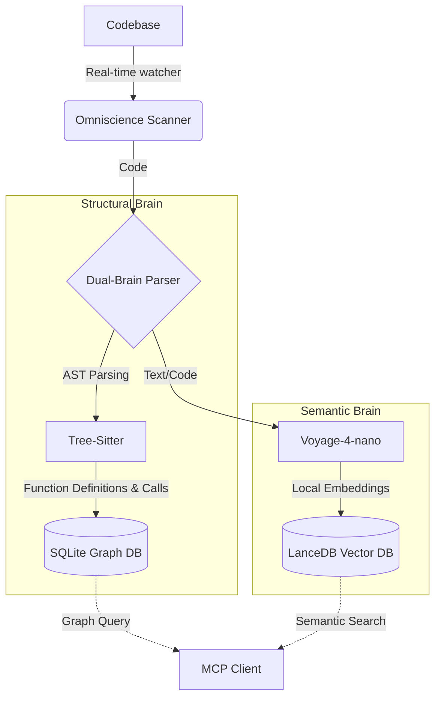

<div align="center">
  
  
  
  
  <h1 align="center">Project Omniscience</h1>
  <p align="center">
    <strong>A Dual-Brain MCP Server for Surgical Code Intelligence</strong>
  </p>
</div>

---

**Omniscience** is a highly optimized Model Context Protocol (MCP) server designed to give Large Language Models (LLMs) token-efficient, surgical access to massive codebases. Instead of flooding the LLM's context window with entire repositories, Omniscience uses a sophisticated **Dual-Brain architecture** to find exactly what the LLM needs—and absolutely nothing more.

## 🧠 The Dual-Brain Architecture



### 1. Structural Brain (Tree-sitter)
Parses the **AST (Abstract Syntax Tree)** of your codebase in real-time. It maps out exact file locations, boundary lines for functions/classes, and automatically generates a complete **Call-Graph** (Caller -> Callee relationships) stored in a local SQLite database.

### 2. Semantic Brain (LanceDB & Voyage-4-nano)
Generates and stores high-quality semantic embeddings of every code symbol completely locally. Allows the LLM to search for abstract concepts (*"how does the auth routing work?"*) using lightning-fast hybrid search.

---

## 🛠️ Exposed MCP Tools

The server exposes powerful tools to the AI, allowing it to navigate your project like a senior engineer.

| Tool | Description | Token Impact |
| --- | --- | --- |
| 🔍 `semantic_search` | Finds relevant code symbols based on a natural language query or keywords. | Low |
| 🕸️ `graph_query` | Returns the **blast radius** of a specific symbol based on the AST Call-Graph. | Low |
| 📖 `surgical_read` | Extracts *only* the exact code snippet for a single function or class. | **Massive Savings** |
| 🏗️ `apply_surgical_patch`| Replaces an exact code symbol with new code and triggers a background re-index. | Low |
| 🔄 `rebuild_index` | Manually triggers a complete re-indexing of the entire workspace. | None |

---

## 🚀 Installation & Setup

Omniscience is designed to be ridiculously fast. We use `uv` for lightning-fast dependency resolution.

```bash
# 1. Clone the repository
git clone https://github.com/FreakyLetsFail/mcp-omniscience.git
cd mcp-omniscience

# 2. Run the Initialization Script (Downloads model, syncs env)
./init.sh
```

### 📦 Standalone CLI Indexer (For Large Repositories)
To prevent your IDE and OS from freezing when opening a massive repository for the first time, Omniscience comes with a standalone CLI tool. It builds the AST Call-Graph and Semantic Vector Database efficiently in the background before you even start your AI.

```bash
./index.sh index /path/to/your/large/project
```
This creates a `.omniscience` folder directly inside your project containing the LanceDB and SQLite databases.

### 🔌 IDE Integration

Add Omniscience to your MCP client configuration (`mcp_config.json`, `claude_desktop_config.json`, etc.):

```json
{
  "mcpServers": {
    "omniscience": {
      "command": "/path/to/mcp-omniscience/run_server.sh",
      "args": []
    }
  }
}
```

> [!TIP]
> **No initialization prompt required!**
> When the MCP server starts in a new `WORKSPACE_DIR`, it automatically builds the vector and graph databases in the background.

---

## 💰 Token Cost Analysis

Why use Omniscience over traditional whole-file reading?

* **Full File Read (server.py):** ~911 Tokens
* **Omniscience Surgical Read (1 function):** ~117 Tokens
* **Context Window Saved:** **87.16%** per interaction!

By isolating exactly what is needed, the LLM hallucinates less, replies faster, and drastically reduces API costs.

---

<div align="center">
  <p>Built with ❤️ for the AI Engineering Community.</p>
</div>
